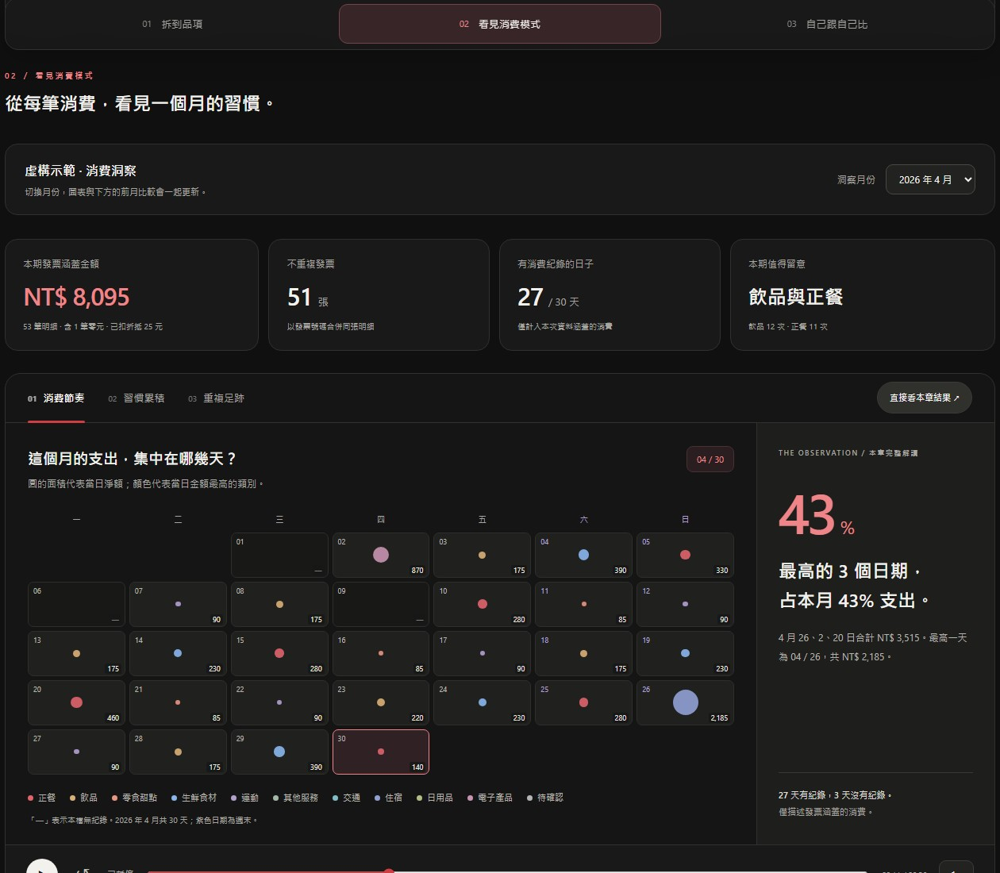

# You are what you buy.

看清每筆消費明細，看懂自己的消費習慣，再選擇在意的項目，跟上個月的自己比較，也跟朋友比比品味有多像。

> 最後更新：2026-10-06

[開啟專題網頁](invoice-insights.html)



網頁已內含兩個月的**虛構示範資料**與所需程式，店家、品項、日期及金額皆為合成，不代表任何人的實際消費。下載這一個 HTML 檔後即可用瀏覽器開啟，不需要另外提供資料檔。若要使用朋友比較功能，請一併下載 `taste-comparison.html`，放在同一資料夾。

## 使用流程

### 黃金圓（Golden Circle）

| 層次 | 專題的回答 |
|---|---|
| 為什麼（Why） | 讓使用者不用一筆筆記帳，也能看懂自己的錢花在哪裡。 |
| 如何做（How） | 把電子發票裡買的東西分類，看看每類花多少錢，以及跟上個月有什麼不同。 |
| 做什麼（What） | 做一個用圖表呈現消費習慣、比較每月變化的網頁。 |

### 操作流程

1. **不用記帳，自動拆到品項**：匯入雲端發票 CSV，讀取明細並分類。
2. **看見自己的消費模式**：用動畫、文字雲、日期圖呈現習慣。
3. **選一個標籤，自己跟自己比**：本月與上月兩欄並排，只呈現改變，不評斷好壞。

## 資料

以下皆為虛構示範，包含折扣、零元贈品與待確認分類，用來展示不同情境。

| 月份 | 明細 | 發票 | 金額 |
|---|---|---|---|
| 2026 年 3 月（示範） | 50 筆 | 48 張 | NT$ 7,910 |
| 2026 年 4 月（示範） | 53 筆 | 51 張 | NT$ 8,095 |

- 示範資料由 `src/receipt/demo.py` 獨立產生，不讀取或改寫私人消費紀錄。
- 分類標籤與配色放在 `configs/report.json`；公開品名對照表也只包含示範品項。
- 沒有 2 月資料，所以 3 月不計算月增減；沒有時分資料，所以不做 24 小時分析。
- `python scripts/build_report.py` 預設產生示範版 `invoice-insights.html` 與 `taste-comparison.html` 比較頁，不讀取私人資料。
- 私人原始檔與設定保留在本機 `data/`；含真實資料的 `invoice-insights-private.html` 不納入版本追蹤，可單檔直接分享。

## 分類標籤

共 10 種：正餐、飲品、零食甜點、生鮮食材、運動、其他服務、交通、住宿、日用品、電子產品。

- 「待確認」是審核狀態，不列入比較選單
- `configs/item-categories.json` 包含 13 個虛構示範品名，其中未分類商品標記為暫定
- 沒有對照到的品名，會自動歸為「待確認」

### 與既有雲端發票服務的差別

以下以「雲端發票」應用程式（Application，App）的官方說明為例，不代表所有發票服務都相同。

| 比較項目 | 雲端發票 App | 本專題 |
|---|---|---|
| 分類方式 | 已有商品類別與次類別，也能調整商品所屬分類 | 目前用人工對照表，將品項歸入上述 10 個標籤；自動分類模型仍在規劃 |
| 分類調整 | 使用者可在 App 內變更商品的類別與次類別 | 目前需修改分類對照表；未對應的品項標示「待確認」 |
| 查看消費 | 提供消費圓餅圖，可自訂日期區間查看 | 提供文字雲、日期分布，以及所選標籤的本月與上月並排比較 |
| 資料使用 | 在 App 內查看發票與消費分析 | 目前先將下載的發票資料在本機轉換，再用網頁查看 |

既有服務已能進行商品分類。本專題著重把分類結果整理成容易理解的消費回顧，並呈現自己每月的變化。

參考：[雲端發票官方說明：消費分析、自訂日期與編輯商品類別](https://www.ecloudlife.com/w/faq/4)（查閱日期：2026-10-06）。

## 技術規劃

| 工作 | 技術 | 狀態 |
|---|---|---|
| 讀取與清理 | Python（目前用標準函式庫 csv；規劃改用 pandas） | 部分完成 |
| 品項分類 | 比較 TF-IDF＋邏輯回歸、Embedding＋邏輯回歸、BERT 微調 | 未開始 |
| 儲存與統計 | DuckDB | 未開始 |
| 前端 | HTML、CSS、JavaScript、SVG | 原型完成 |

模型評估：會實作上述三種模型，在相同資料與評估條件下，比較分類效果，以及訓練、推論、記憶體與硬體等成本，再選擇合適的方法。正式流程規劃在本機執行。

### 專案結構

```text
receipt/
├── README.md                     # 專題說明與操作指令
├── pyproject.toml                # Python 版本與相依套件設定
├── .gitignore
├── invoice-insights.html         # 已內嵌示範資料與程式的公開成品
├── invoice-insights-private.html # 真實資料原版，僅留本機、不上傳
├── taste-comparison.html         # 偏好連結匯入與朋友比較
├── presentation.html             # 可直接開啟的兩頁簡報
├── readme_pic.jpg                # README 使用的專題預覽圖
├── configs/
│   ├── report.json               # 輸入資料清單、分類名稱與配色
│   └── item-categories.json      # 品名與分類的人工對照
├── src/
│   ├── receipt/
│   │   ├── __init__.py
│   │   ├── demo.py               # 獨立產生虛構示範消費
│   │   ├── invoices.py           # 解析、分類與發票號碼代碼化
│   │   └── build.py              # 整合資料、樣式與程式，產生單檔網頁
│   └── web/
│       ├── invoice-insights.html # 網頁原始模板，不含發票資料
│       ├── styles.css            # 網頁樣式
│       ├── insights-ui.js        # 消費洞察與圖表
│       ├── monthly-comparison.js # 月份比較計算
│       ├── comparison-ui.js      # 比較介面
│       ├── flow-navigation.js    # 三區域導覽
│       ├── taste-comparison.html # 朋友品味比較頁來源
│       ├── taste-profile.js      # 偏好摘要與分享連結格式
│       └── taste-export.js       # 報告匯出與比較入口
├── scripts/
│   └── build_report.py           # 產生網頁的執行入口
├── tests/                        # 資料、產生流程與前端測試
├── data/                         # 僅留本機，不追蹤到 Git
│   ├── raw/                      # 原始發票 CSV
│   ├── processed/                # 產生的示範 report-data.js
│   └── private/                  # 私人設定、品名對照與備份
└── prototypes/
    └── annual-review.html        # 保留的早期年度回顧原型
```

修改網頁請編輯 `src/web/`，再執行下列指令更新根目錄成品；根目錄的 `invoice-insights.html` 會以示範資料重新產生，私人版本不會被覆寫；同時更新 `taste-comparison.html` 比較頁。簡報直接編輯 `presentation.html`。

目前 Python 程式只使用標準函式庫，需 Python 3.10 以上；前端測試另需 Node.js。

```sh
python scripts/build_report.py
python -m unittest discover -s tests -v
node --test tests/monthly-comparison.test.cjs tests/comparison-interface.test.cjs tests/taste-profile.test.cjs
```

公開示範版與全部測試都不需要私人資料，可在剛下載的專案直接執行。

若要重新產生自己的報告，先在 `data/private/report.json` 設定 `input_files`（原始 CSV 路徑）、`category_catalog`（私人品名對照表路徑）與 `categories`（分類名稱及配色，可參考公開設定）。所有路徑相對於專案根目錄，再執行：

```sh
python scripts/build_report.py --private
```

此指令只更新 `invoice-insights-private.html`，不覆寫公開示範版。CSV 指逗號分隔值（Comma-Separated Values）檔案，目前接受電子發票匯出欄位，一份檔案一個月。

`data/`、`invoice-insights-private.html` 與未來的 `models/` 已排除版本追蹤。私人版本仍含真實店家、品名、日期與金額，請自行決定分享對象。

目前尚未訓練模型或提供後端服務，因此不建立空的模型訓練、特徵工程、筆記本或服務目錄，待功能實作時再加入。

## 與朋友比較偏好

報告上方可點「比較跟朋友品味差多少」帶入自己的摘要。「匯出我的品味連結」目前只保留按鈕，暫不開放點選。到[朋友比較頁](taste-comparison.html)貼上兩人的連結；只匯入一人時先顯示自己的分布，兩人到齊後顯示連線與相似百分比。

連結只包含暱稱、報告涵蓋月份及 10 類已確認品項的筆數，不含店家、品名、單筆日期、金額或發票號碼。依正金額品項逐筆計數，排除折扣、贈品及待確認分類，並涵蓋全部月份。資料放在網址片段（URL Fragment）內，不上傳至伺服器；這不是加密，取得完整連結的人可以讀取摘要。公開示範版匯出的仍是虛構資料。

目前比較分類比例的餘弦相似度（Cosine Similarity），100% 表示比例相同、0% 表示沒有共同類別；還不能分辨半糖／無糖或水餃餡料。品項層級的細節仍保留在示範人物中；混用匯入摘要時會統一成分類模式。

本機 `file:` 連結不能讓朋友直接開啟你的電腦檔案，但可以完整貼入他自己的比較頁讀取。把 `invoice-insights.html` 與 `taste-comparison.html` 放在同一網站目錄後，匯出按鈕會使用目前網站位址產生可直接開啟的連結。

## HTML 簡報

[開啟專題簡報](presentation.html)

共 2 頁，介紹使用流程、技術架構、三種模型的成本與效果比較規劃，以及企業商品資訊洞察的延伸應用。下載後可直接用瀏覽器開啟，使用畫面按鈕或鍵盤左右鍵翻頁。

> 以上為專案內的相對連結。在 GitHub 儲存庫點選會顯示原始碼；若要讓訪客直接在線上觀看，需將網頁與簡報發布至網頁託管服務。
