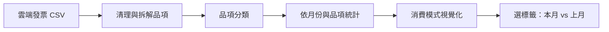

# You are what you buy.

不用逐筆記帳，從發票品項看見自己的消費模式，再選一個在意的項目，跟上個月的自己比。

## 使用流程

1. **不用記帳，自動拆到品項**：匯入雲端發票 CSV，讀取明細並自動分類。例如同一張超商發票，分開看正餐、飲品與日用品。
2. **看見自己的消費模式**：用動畫、中文文字雲、日期圖呈現習慣。例如「運動購票最頻繁，正餐花得最多」。
3. **選一個項目，自己跟自己比**：選擇分類後的消費標籤，用兩欄並排比較本月與上月，呈現改變，不評斷好壞。

## 系統架構

## 技術

| 工作 | 預計使用的技術 | 用途 |
|---|---|---|
| 讀取與清理 | Python、pandas | 統一日期、品名、金額與發票明細；折扣與費用另外處理 |
| 自動分類 | scikit-learn、sentence-transformers、transformers | 比較 TF-IDF＋邏輯回歸、Embedding＋邏輯回歸、BERT 微調，依測試結果選模型 |
| 儲存與統計 | DuckDB | 按月份、類別、品項加總，產出前端需要的資料 |
| 前端 | HTML、CSS、JavaScript、SVG | 回顧動畫、文字雲、日期圖與月份比較 |

分類模型使用人工確認的資料訓練，比較 macro-F1 與推論速度；未確認的品項留待使用者修正。數字由程式計算，解讀文字由模板填入。正式流程規劃在本機執行，不需使用者呼叫外部 AI API。

## 自己跟自己比

- 預計由 Embedding 分類流程將品項歸入約 10–15 個標籤，前端以標籤比較，不列出個別商品。
- 目前提供 10 種標籤：正餐、飲品、零食甜點、生鮮食材、運動、其他服務、交通、住宿、日用品、電子產品。「待確認」是審核狀態，不列入比較選單。
- 同一個標籤，同時呈現上月與本月，指標逐列對齊；與洞察區使用一致的深色風格。
- 比較金額、消費次數、消費天數、平均每次金額與整月每日平均。
- 差額＝本月－上月；增減率＝差額 ÷ 上月 × 100%。上月為零時不計增減率。
- 同一張發票中的同一標籤只計一次付費消費，商品數量不當成消費次數。
- 月份天數不同，另外提供每日平均；沒有上月資料時顯示「尚無資料」，不當成零。

## 目前進度

**已完成**：兩份 CSV 的本機轉換腳本、人工分類對照表，以及回顧動畫、文字雲、日期分布、月份切換、10 種消費標籤選擇與月份並排比較。

**尚待完成資料流程**：網頁 CSV 上傳、通用格式清理、模型訓練與分類、DuckDB 串接。現有頁面讀取本機腳本輸出的資料，分類仍採人工對照，尚未接模型。

已載入 **2026 年 3 月與 4 月真實資料**：三月 35 筆明細、20 張發票、NT$ 4,392；四月 52 筆明細、33 張發票、NT$ 10,817（已扣折抵 NT$ 142）。切換洞察月份會同步更新圖表、週末日期、解讀與前月比較。三月的前月二月尚無資料，不計增減。示範模式另行標示；沒有時分資料，所以不做 24 小時分析。

前端入口：`invoice-insights.html`，與同資料夾的 JavaScript 檔一起保留。資料更新時執行 `python build_report_data.py`，從兩份 CSV 產生匿名化的 `report-data.js`；原始發票號碼不寫入網頁。
