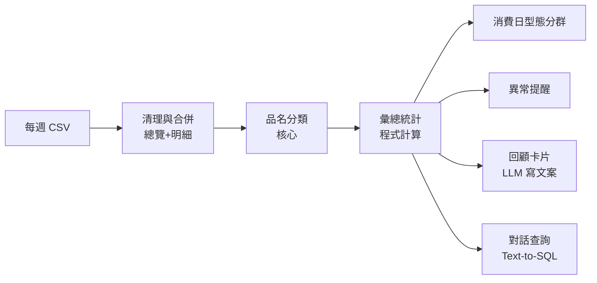

# 發票回顧（暫名）— 專題企劃

> 狀態：草稿 v0.1（2026-10-05）
> 情境：求職專題發表會，廠商在攤位停留約 2～3 分鐘
> 時程：約 6 週（2026-10-05 起，demo 日期待確認）
> 硬體：RTX 4060（8GB）、32GB RAM，可本機跑模型

---

## 1. 一句話

匯入自己的雲端發票，AI 把**每一個品項**分類，產生像 Spotify 年度回顧一樣的消費卡片，讓你**看見**自己的消費習慣。

---

## 2. 要解決的問題

| | 內容 |
|---|---|
| **誰在痛** | 想知道錢花去哪、但記帳記不下去的人，幾乎所有人 |
| **現在怎麼做** | 手動記帳，通常三天就放棄；已有記帳 App 能匯入發票，但大多只按**店家**分類，例如「便利商店 $38,000」 |
| **不夠的地方** | 在超商買的有飲料、便當、日用品，混在一起看不出問題 |
| **真正的問題** | 不是「記不下來」，而是「沒注意到」：資料都有，但一張表格沒人想看，習慣就不會改變 |
| **這個專題改變什麼** | 拆到**品項**分類，再用回顧卡片讓人「看見」自己的習慣，例如「你今年喝了 412 杯飲料，等於 2.1 萬元，夠買一台 Switch」 |

**一句話價值**：從「記錄花了多少」變成「發現自己的消費習慣」。

**產業連結**：銀行、電商、零售都重視「消費洞察」，這個專題展示的是把雜亂交易資料轉成洞察的能力。

---

## 3. 資料

### 來源：財政部電子發票整合服務平台
登入後，在個人化服務開啟「**消費發票彙整通知**」，平台會**每週**寄送 CSV：

| 資料列 | 欄位 |
|---|---|
| 發票總覽 | 發票狀態、發票號碼、發票日期、商店統編、商店店名、載具名稱、載具號碼、總金額 |
| 品項明細 | 發票號碼、小計、**品項名稱** |

### 已知限制

| 限制 | 影響 | 對策 |
|---|---|---|
| 歷史資料可能只有約半年（第三方說法，未見官方原文） | 做不出完整「年度」回顧 | 改成「半年回顧」；從現在起訂閱每週 CSV 持續累積 |
| 品名品質不一（「餐費」、奇怪縮寫） | 只看品名會分錯 | 把**商店名稱**也當成分類依據；這也是需要 AI 的理由 |
| CSV 可能沒有消費時間（只有日期） | 不能做「深夜消費」這類分析 | 分析只用日期層級；拿到資料後確認 |
| 只有你一個人的真實資料 | 廠商無法當場用自己的資料 | 加上幾組**模擬人物**的資料（明確標示為模擬） |

### 隱私
- 資料只在本機處理，demo 時遮蔽發票號碼和載具號碼
- 模擬人物資料在畫面上標明「模擬資料」

---

## 4. 系統流程

**設計原則：數字由程式算，LLM 只負責寫文案。** 卡片上的每個數字都來自彙總統計，LLM 不能自己生數字，避免它編出錯的金額。

---

## 5. 各模組與技術

| # | 模組 | 做什麼 | 技術 | 優先度 |
|---|---|---|---|---|
| 1 | **品名分類** | 「茶裏王無糖綠」→ 飲料 | 4 種方法比較（見 5.1） | **必做** |
| 2 | 消費日型態分群 | 把你的每一天分成幾種型態 | ML（K-means） | **必做** |
| 3 | 回顧卡片 | 個人化、帶幽默感的文案與卡片 | LLM + 介面 | **必做** |
| 4 | 異常提醒 | 「這週外送是平常的 3 倍」 | ML（統計異常偵測） | 選做 |
| 5 | 對話查詢 | 「我上個月飲料花多少？」 | LLM 轉 SQL 查詢 | 選做 |
| 6 | 紙本收據 | 拍照補上沒存進載具的消費 | CV（OCR） | 有時間再做 |

### 5.1 品名分類（核心，面試重點）

**分類表（第一版，約 12 類）**

| 類別 | 例子 |
|---|---|
| 飲料 | 茶裏王、拿鐵、手搖飲 |
| 正餐 | 便當、御飯糰、麵 |
| 零食點心 | 洋芋片、餅乾、冰淇淋 |
| 生鮮食材 | 蔬菜、肉、雞蛋 |
| 日用品 | 衛生紙、洗衣精 |
| 個人保養 | 洗面乳、藥妝 |
| 外送 | 外送平台訂單 |
| 交通 | 加油、停車 |
| 娛樂 | 電影、遊戲 |
| 3C | 充電線、耳機 |
| 服飾 | 衣服、鞋 |
| 其他 | 無法判斷 |

**標註方式**
- 先把重複的品名合併成唯一品名（唯一品名通常遠少於發票數）
- 用 LLM 先自動標一輪，再人工校正，目標約 1,000 筆
- 切出約 300 筆人工確認過的**測試集**，所有方法都用同一份測試集比較

**四種方法比較**

| 方法 | 做法 | 用到的技術 |
|---|---|---|
| ① 基準線 | 品名 + 店名轉成 embedding，再用傳統分類器 | Transformer + ML |
| ② 直接問 LLM | 不訓練，直接請 LLM 分類 | Transformer |
| ③ RAG 找範例 | 從已標註資料找出最相似的品名當範例，再請 LLM 分類 | RAG |
| ④ LoRA 小模型 | 用標註資料微調本機小模型（1.5B～3B 等級） | LoRA |

**評估指標**：準確率、macro-F1、每千筆成本、速度。成果是一張比較表，用來說明「最後為什麼選 X」。

### 5.2 消費日型態分群
- 把每一天轉成「各類別花費比例」的向量，用 K-means 分群
- 例如分出：「平凡上班日」「週末補償日」「月初爆買日」
- 只用一個人的資料也能做，不需要很多使用者

### 5.3 回顧卡片
- 程式先算好統計數字（總花費、前幾名類別、最常去的店、最愛的品項）
- LLM 依照這些數字寫文案，並自動檢查文案中的數字是否與統計一致
- 卡片風格參考 Spotify 年度回顧：一張一個重點，可左右滑動

---

## 6. 評估

| 項目 | 方法 | 成功標準 |
|---|---|---|
| 品名分類 | 300 筆測試集 | 最佳方法 macro-F1 明顯高於基準線 |
| 卡片數字正確性 | 自動比對文案數字與統計 | 100% 一致 |
| 使用者感受 | 找 5～10 位朋友看自己的回顧 | 多數人回答「有發現一件以前不知道的事」 |

---

## 7. Demo 規劃（攤位 2～3 分鐘）

1. **一句痛點**（10 秒）：「你知道自己今年喝了幾杯飲料嗎？」
2. **播放回顧卡片**（60 秒）：先用自己的資料，再切換一組模擬人物
3. **讓廠商挑戰分類器**（30 秒）：請廠商輸入一個奇怪的品名，看 AI 怎麼分 ← 攤位互動點
4. **秀比較表**（30 秒）：四種方法的準確率與成本，說明為什麼最後選它

**備案**：全程本機模型，不怕會場網路斷線；另外錄一支完整操作影片。

---

## 8. 時程（6 週）

| 週 | 日期 | 目標 | 完成標準 |
|---|---|---|---|
| W1 | 10/05–10/11 | 確認資料、定分類表 | 登入平台看到自己的資料；開啟每週彙整通知；確認可查期間和欄位；定好分類表 |
| W2 | 10/12–10/18 | 清理、標註、基準線 | 約 1,000 筆標註完成；方法①有分數 |
| W3 | 10/19–10/25 | LLM 與 RAG 方法 | 方法②③有分數 |
| W4 | 10/26–11/01 | LoRA 與比較表 | 方法④有分數；比較表完成 |
| W5 | 11/02–11/08 | 分析與卡片 | 分群、卡片文案、介面可跑通 |
| W6 | 11/09–11/15 | Demo 打磨 | 模擬人物、互動挑戰、彩排、備用影片、海報或簡報 |

> 若 demo 日期早於 11/15，優先砍掉選做項目，W4 的 LoRA 可縮成只比較兩種設定。

---

## 9. 建議技術工具

| 用途 | 工具 |
|---|---|
| 資料處理 | Python、pandas、DuckDB |
| embedding | bge-m3 等中文 embedding 模型 |
| 傳統分類器、分群 | scikit-learn |
| 本機 LLM | Ollama |
| LoRA 微調 | PEFT 或 Unsloth（QLoRA，8GB 顯存可行） |
| 介面 | Streamlit |

---

## 10. 風險與對策

| 風險 | 對策 |
|---|---|
| 歷史資料太少 | 半年回顧＋持續累積＋模擬人物 |
| 品名太爛分不出來 | 加入店名；分不出來的歸「其他」並統計比例 |
| 標註太花時間 | LLM 先標、人工只校正 |
| 4060 顯存不夠做 LoRA | 改用更小的模型，或用 Colab 訓練、本機推論 |
| 會場網路不穩 | 全程本機模型＋備用影片 |

---

## 11. 面試可以講的重點

1. **比較表**：用數據說明為什麼選這個方法，而不是「因為 LoRA 很潮」
2. **RAG 的巧妙用法**：不是做文件問答，而是找相似範例來提升分類準確率
3. **知道什麼時候不用 RAG**：「上個月花多少」是加總計算，要轉成 SQL 查詢才算得準
4. **數字由程式算、LLM 只寫文案**：避免 AI 編造金額的設計

---

## 12. 待確認事項

- [ ] 發表會 demo 日期
- [ ] 登入平台後，實際能查到多久以前的資料
- [ ] CSV 是否包含消費時間
- [ ] 抽查 50 筆品名，看品質如何
- [ ] 是否有朋友願意提供資料做使用者測試

---

### 參考資料
- [財政部電子發票整合服務平台](https://www.einvoice.nat.gov.tw/)
- [電子發票整合服務平台說明文件（個人化服務：消費發票彙整通知）](https://www.einvoice.nat.gov.tw/static/ptl/ein_upload/download/7.pdf)
- [如何匯出雲端發票？發票載具的明細要怎麼備份？｜發票存摺 invos](https://news.invos.com.tw/?p=5361)
