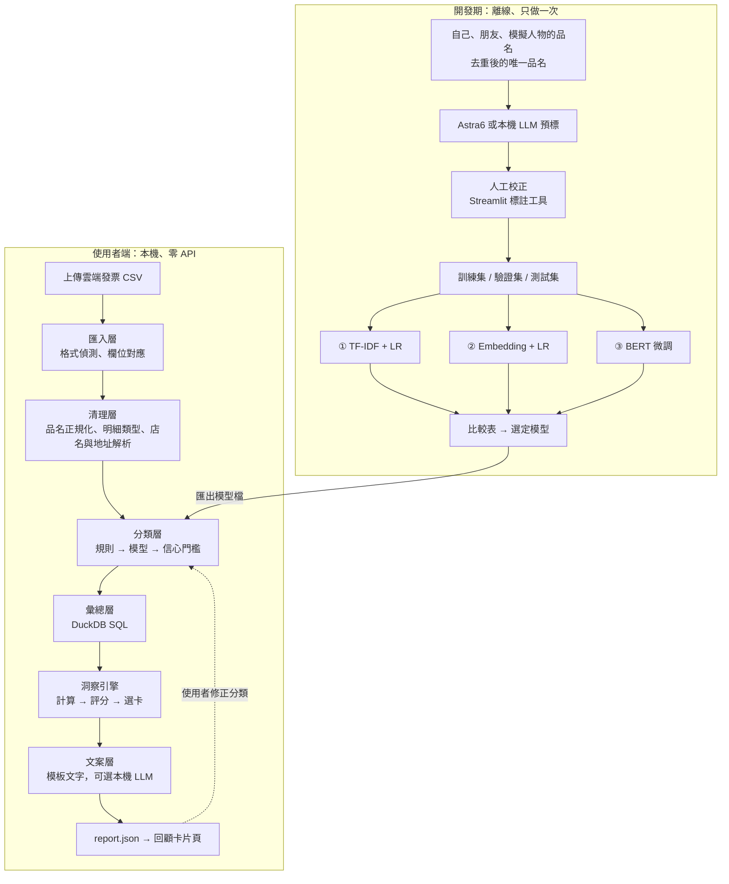

# 發票回顧 — 技術框架（使用者端不接 API）

> 狀態：草稿 v0.1（2026-10-05）
> 對應：[發票回顧-專題企劃.md](發票回顧-專題企劃.md)。本文件取代企劃 §5.1 的四種方法比較，其餘目標不變
> 前提：使用者只上傳財政部平台下載的 CSV，其他都在本機完成

---

## 0. 結論

**可以。** 「洞察」其實是四件事，其中只有一件真的需要 AI：

| 目前 Astra6 負責的事（依現有報告推測） | 改成什麼（不接 API） | 能不能做到差不多 |
|---|---|---|
| 判斷每個品項屬於哪個類別 | **三種分類模型**（本專題核心比較） | ✅ 可以。類別表固定時，用自己的資料訓練的小模型常能追上通用 LLM；前提是有足夠的人工確認標註 |
| 算數字（總額、占比、次數、間隔） | pandas / DuckDB | ✅ 本來就該由程式算，而且更準 |
| 判斷哪些事值得講 | 洞察評分規則（變化幅度、異常程度、資料量） | ✅ 可以，而且每張卡都能說明為什麼被選上 |
| 寫文案 | 模板產生文字；可選本機小 LLM 潤飾 | ⚠️ 數字一定正確，但用字變化較少，要多寫幾組模板 |
| 看懂沒見過的品名（新品牌、怪縮寫） | 信心不足時標「待確認」，讓使用者修正 | ⚠️ 小模型最弱的地方。TF-IDF 最弱，BERT 微調最好 |

**關鍵做法：LLM 當老師，小模型當學生。** 開發期用 Astra6（或本機 LLM）幫忙預先標註一次，人工校正後拿來訓練小模型；使用者端只跑小模型，零 API、零成本，資料也不會離開本機。

> 名詞說明：BERT 本身就是 Transformer。第三種方法這裡稱為「**BERT 微調**」，意思是連模型本體一起訓練；第二種「Embedding + LR」的模型本體不訓練，只訓練最後的分類器。兩者差在 encoder 有沒有被調整。

---

## 1. 系統架構



**設計原則（沿用企劃）**：數字由程式算；文案只能填入程式算好的數字。

---

## 2. 匯入層與清理層

### 2.1 匯入：兩種 CSV 格式都要能讀

| 來源 | 格式 | 處理 |
|---|---|---|
| 每週「消費發票彙整通知」 | `M\|...` 發票總覽列、`D\|...` 品項明細列，以 `\|` 分隔 | 依開頭字元拆成兩張表，用發票號碼合併 |
| 平台查詢後下載（如 `0301-0331.csv`） | 一列一個品項，欄位如 `消費明細_金額`、數量、賣方名稱、地址 | 直接讀取，再做欄位對應 |

- 自動偵測編碼（UTF-8 含 BOM 或 Big5）和格式，再對應成統一的內部欄位：
  `date, invoice_id, store_tax_id, store_name, store_address, item_name, quantity, amount, status`
- 欄位不存在就設為空值，相關的洞察自動略過（例如沒有時間欄位，就不做 24 小時節奏）
- 發票號碼、載具號碼匯入後立即換成代碼（如 `R01`），不寫進 report.json

### 2.2 清理：分類前先處理掉的事

| 步驟 | 做法 | 例子 |
|---|---|---|
| 品名正規化 | 全形轉半形（NFKC）、去掉規格與數量字樣 | `茶裏王無糖綠茶600ml x2` → `茶裏王無糖綠茶` |
| 明細類型 | 規則判斷：商品、折扣、運費／處理費、購物袋、零元贈品 | `Uber 處理費` → 費用；負數金額 → 折扣 |
| 店名正規化 | 去掉公司型態與分店字樣，對應連鎖品牌字典 | `全聯實業股份有限公司台南湖美分公司` → 品牌 `全聯`、分店 `台南湖美` |
| 地址解析 | 正規表示式抓縣市與行政區，`臺` 統一成 `台` | → `台南市`、`安南區` |
| 商家行業別（加分） | 用統編查財政部「全國營業（稅籍）登記」開放資料，離線查表 | 統編 → 行業名稱，可當分類特徵，對沒看過的品名特別有用 |
| 屬性抽取 | 規則抓甜度、冰塊、酒精、容量 | `黑米-0分糖,微冰,珍珠` → 甜度 0、微冰 |

---

## 3. 品項分類（核心）

### 3.1 分類表

建議用兩層：模型預測**大類**，細節用規則補成**標籤**，標註量不會暴增。

| 大類（約 10 類） | 例子 | 規則標籤（不需要模型） |
|---|---|---|
| 正餐 | 便當、拉麵、排餐 | 多人份（數量 ≥ 3） |
| 飲品 | 茶裏王、拿鐵、手搖飲 | 酒精、含糖、咖啡 |
| 零食甜點 | 洋芋片、冰淇淋 | — |
| 生鮮食材 | 雞蛋、蔬菜、肉 | — |
| 日用品 | 衛生紙、洗衣精 | — |
| 個人保養 | 洗面乳、藥品 | — |
| 交通 | 加油、停車 | — |
| 娛樂與運動 | 電影、健身房票券 | — |
| 3C 與服飾 | 充電線、衣服 | — |
| 其他 | 無法判斷 | — |

> 外送不另成一類：用店家（Uber Eats、foodpanda）判斷「通路」，品項照樣分到正餐或飲品，兩個角度都能看。

### 3.2 分類流程（三層）

```
1. 規則層：明細類型（折扣、費用）、使用者自己改過的品名、已人工確認的品名直接查表
2. 模型層：選定的模型輸出各類機率
3. 信心門檻：最高機率 < 門檻 → 標「待確認」，顯示在「資料處理狀態」並讓使用者修正
```

- 使用者修正會存進個人字典，下次直接套用；累積後也能加回訓練資料
- **店家純度規則**：某品牌在標註資料中 ≥ 95% 屬於同一類（例如加油站），整家店直接套用該類
- 進階（選做）：先用 TF-IDF 分；信心不足的才交給 BERT，兼顧速度和準確率

### 3.3 三種方法

| | ① TF-IDF + LR | ② Embedding + LR | ③ BERT 微調 |
|---|---|---|---|
| 一句話 | 看品名出現哪些字和字組 | 用預訓練模型把品名轉成向量，再訓練簡單分類器 | 整個模型依你的資料一起調整 |
| encoder 有沒有訓練 | 沒有 encoder | 凍結，不訓練 | 訓練 |
| 輸入 | 品名字元 1–3 gram ＋ 店名品牌 | 「品名｜店名」的向量 | `品名 [SEP] 店名（＋行業別）` |
| 建議模型 | scikit-learn | `bge-small-zh-v1.5`、`bge-m3`、`Qwen3-Embedding-0.6B` | `ckiplab/bert-base-chinese`（繁中）、`hfl/chinese-macbert-base` |
| 看過的品名 | 強 | 強 | 強 |
| 沒看過的品牌 | 弱：沒看過「品客」就不知道是零食 | 中到強：預訓練時可能學過 | 強 |
| 訓練時間（4060） | 秒級 | 分鐘級，主要花在算向量 | 數分鐘到十幾分鐘 |
| 模型大小 | 幾 MB | 約 0.1–2 GB | 約 0.4 GB |
| 可解釋性 | 高：LR 係數看得出是哪個字組決定的 | 低 | 低 |
| 能否在瀏覽器跑 | 可以，權重匯出成 JSON | 小模型可以（transformers.js） | 可以，轉 ONNX 並量化 |

**預期（要用實驗證實）**：看過的品名三種都很高，差距主要出現在**沒看過的品名**，通常 ③ ≥ ② > ①。如果 ① 和 ③ 差很少，① 就是最好的選擇，因為更小、更快、更好解釋。比較表要回答的就是這個問題。

### 3.4 各方法實作要點

**① TF-IDF + LR**

```python
from sklearn.compose import ColumnTransformer
from sklearn.feature_extraction.text import TfidfVectorizer
from sklearn.linear_model import LogisticRegression
from sklearn.pipeline import Pipeline

features = ColumnTransformer([
    ("name", TfidfVectorizer(analyzer="char", ngram_range=(1, 3), sublinear_tf=True), "name_norm"),
    ("store", TfidfVectorizer(analyzer="char", ngram_range=(2, 3)), "store_brand"),
])
model = Pipeline([
    ("features", features),
    ("lr", LogisticRegression(C=5, class_weight="balanced", max_iter=2000)),
])
```

- 中文不用斷詞，直接用字元 n-gram，對縮寫和錯字比較耐受
- `C` 用交叉驗證調整；`class_weight="balanced"` 處理類別不平衡

**② Embedding + LR**

- `sentence-transformers` 算向量並正規化，再用同樣的 LR
- 品名去重後只算一次向量並快取；使用者端也只算沒看過的品名
- 實驗變因：模型大小（small 或 m3）、要不要加店名、繁轉簡（`bge-*-zh` 多以簡體訓練，可用 OpenCC 轉換後比較）

**③ BERT 微調**

```
模型：ckiplab/bert-base-chinese（tokenizer 依 CKIP 說明使用 bert-base-chinese 的 BertTokenizerFast）
輸入：品名 [SEP] 店名品牌
max_length 48、batch 32、學習率 2e-5～5e-5、5～10 個 epoch、fp16
用驗證集 macro-F1 做 early stopping；資料少時容易過擬合
```

- softmax 機率通常偏高，要用驗證集做 temperature scaling，信心門檻才有意義
- 推論可轉成 ONNX 並量化，CPU 也跑得動

### 3.5 標註資料

| 步驟 | 做法 |
|---|---|
| 1. 去重 | 正規化後的唯一品名，通常遠少於明細筆數 |
| 2. 預標 | 開發期用 Astra6（或本機 LLM）預標類別和信心，**只在開發期使用** |
| 3. 校正 | Streamlit 標註工具，低信心的排在前面，人工只改錯的 |
| 4. 擴充 | 朋友資料（先取得同意）、模擬人物；LLM 生成的合成品名**只能放進訓練集** |
| 5. 主動學習 | 先訓練 TF-IDF，挑模型最不確定的品名優先人工標註 |

目標：約 1,000 筆訓練、300 筆**全部人工確認**的測試集。

### 3.6 評估

**切分方式**
- 先依正規化品名去重，再依「人」或「月份」分組切分，避免同一個品名同時出現在訓練集和測試集
- 從測試集另外挑出「**未見品名**」子集：品名和品牌都沒在訓練集出現過，模擬新使用者上傳的情況
- 測試集答案一律用人工確認的標籤，不能直接用 Astra6 的標籤，否則測到的是「多像 Astra6」，不是「多正確」

**指標**

| 指標 | 為什麼要看 |
|---|---|
| macro-F1 | 類別不平衡，小類別也要分對 |
| 未見品名 macro-F1 | 最接近真實使用情境 |
| 金額加權準確率 | 分錯一筆 2,000 元比分錯 5 元嚴重 |
| 類別占比誤差（pp） | 直接反映洞察卡上的數字會差多少 |
| 自動分類比例 | 在信心門檻下，有多少比例不用請使用者確認 |
| 與 Astra6 一致率 | 回答「有沒有差不多」的直接證據 |
| 推論速度、模型大小 | 部署成本 |

**比較表樣板**

| 方法 | macro-F1 | 未見品名 F1 | 金額加權準確率 | 占比誤差 | 每千筆時間 | 模型大小 | 需要網路 |
|---|---|---|---|---|---|---|---|
| ① TF-IDF + LR | | | | | | | 否 |
| ② Embedding + LR | | | | | | | 否 |
| ③ BERT 微調 | | | | | | | 否 |
| 參考：Astra6 | | | | | | — | 是 |

**附加實驗（面試加分）**
- 學習曲線：訓練資料 200 / 500 / 1,000 筆時的 F1，回答「要標多少才夠」
- 消融實驗：只用品名、加店名、再加行業別

**建議的成功標準**（可再調整）：最佳本機模型的 macro-F1 與 Astra6 差距 ≤ 3 個百分點，且各類別占比誤差 ≤ 2 pp。

---

## 4. 洞察引擎

### 4.1 參考 YouTube 洞察頁的設計

| YouTube 洞察 | 對應到發票 |
|---|---|
| 最近 7 / 28 / 90 / 365 天 | 期間切換，受限於資料涵蓋範圍 |
| 資料處理狀態：興趣資料尚未齊全 | 「有 N 筆品項尚待確認，結果可能調整」 |
| 觀看節奏：24 小時玫瑰圖 | 消費節奏：星期 × 週次熱力圖；有時間欄位才做 24 小時 |
| 主題關鍵字雲，新出現的上色 | 各類別關鍵字雲，本期新出現的品項上色 |
| 注意力變化：新進、退場、±pp | **錢包注意力變化**：類別、店家、品項的占比變化 |

### 4.2 洞察清單

| # | 洞察 | 範例文案 | 計算方式 | 優先度 |
|---|---|---|---|---|
| 1 | 類別結構 | 正餐占了 78% | 分類後依類別加總 | 必做 |
| 2 | 店家視角 vs 品項視角 | 同一張全聯發票，其實拆成飲品、零食、生鮮 | 同店家的類別分布 | 必做（展示分類價值） |
| 3 | 消費節奏 | 三個日期占了過半支出 | 依日期與星期彙總、前幾名占比 | 必做 |
| 4 | 錢包注意力變化 | 飲品 ▲6.3pp，新進：手搖飲 | 兩個期間的占比相減，標新進、退場 | 必做（需兩期資料） |
| 5 | 重複足跡 | 體適能票券 7 次，平均每 2.5 天一次 | 同品項購買間隔的中位數與變異係數 | 必做 |
| 6 | 資料處理狀態 | 3 筆零元、2 筆待確認 | 計數 | 必做 |
| 7 | 小額累積 | 100 元以下的小東西加起來夠買一台 Switch | 低單價品項加總，換算成參考物品 | 加分 |
| 8 | 各類別關鍵字雲 | 飲品：茶裏王、拿鐵、紅茶 | 每類詞頻（jieba ＋ 品牌詞典） | 加分 |
| 9 | 屬性偏好 | 手搖飲 8 成點無糖 | 規則抽出的甜度、冰塊、酒精 | 加分 |
| 10 | 地理足跡 | 3/24–25 你在台中 | 地址解析；離開最常出現的城市 = 外出日 | 加分 |
| 11 | 個人通膨 | 你常買的東西平均漲了 4% | 重複品項的單價（金額 ÷ 數量）變化 | 加分 |
| 12 | 消費日型態 | 平凡上班日、週末補償日 | 每日類別比例向量，K-means | 選做（企劃原有） |
| 13 | 異常提醒 | 這週外送是平常的 3 倍 | 週類別花費與歷史中位數比較（MAD） | 選做 |
| 14 | 購物籃 | 買啤酒時有 7 成會帶零食 | 同張發票的關聯規則（mlxtend） | 選做 |
| 15 | 訂閱偵測 | 每月固定扣款 3 筆 | 同店家、金額相同、間隔約 30 天 | 選做 |
| 16 | 店家忠誠度 | 前 3 家店占 60%，本期新去了 5 家 | 店家集中度、首次出現比例 | 選做 |
| 17 | 外送依賴度 | 正餐有 4 成是外送 | 店家品牌字典判斷通路 | 選做 |

> 表中數字為示意。每項洞察都要設定**最低資料量**，不足就不出卡，例如注意力變化需要兩個完整期間、重複足跡至少要 3 次、K-means 至少要 30 個有紀錄的日子。

### 4.3 洞察卡資料格式

每張卡只放程式算好的事實，文案層只能使用這些數字：

```json
{
  "id": "habit.repeat_item",
  "period": { "start": "2026-03-01", "end": "2026-03-31" },
  "score": 0.82,
  "facts": {
    "item": "體適能中心-體適能-全票",
    "count": 7,
    "unit_price": 50,
    "total": 350,
    "median_gap_days": 2.5,
    "max_gap_days": 4
  },
  "evidence": ["R17", "R16", "R15", "R13", "R05", "R04", "R01"],
  "caveats": ["票券紀錄代表購買行為，不等於實際運動次數"]
}
```

`caveats` 延續現有報告的寫法（例如「沒有紀錄不代表沒有消費」），每張卡都附上限制說明。

### 4.4 選卡與排序

```
分數 = 效果大小（占比、pp 變化、異常程度，正規化到 0～1）
     × 可信度（資料量、分類信心）
     × 新鮮度（上期出現過的卡打折）
```

- 取前 5～7 張，固定第一張是總覽
- 同一類別不連續出現兩張
- 每張卡都能回答「為什麼選它」，面試時可以直接展示

---

## 5. 文案（不接 API）

| 方式 | 做法 | 優點 | 缺點 |
|---|---|---|---|
| **模板產生文字（預設）** | 每種洞察 3～5 組句型，依數值大小選用（例如倍數 > 2 用「翻倍」） | 數字 100% 正確、速度快、可離線 | 寫多了會覺得重複 |
| 本機 LLM 潤飾（選配） | Ollama 跑 7B 以下的指令模型（Q4 量化，8GB 顯存可以跑），只改寫模板句 | 用字比較活 | 可能改錯數字 |

模板範例（`habit.repeat_item`）：

```
中性：「{item_short}這個月出現了 {count} 次，平均每 {median_gap_days} 天一次。」
幽默：「{item_short}是你這個月最忠實的夥伴：{count} 次，從沒離開超過 {max_gap_days} 天。」
```

使用本機 LLM 時：抽出輸出文字裡的所有數字，必須都能在 `facts` 裡找到，否則改用模板原句。

---

## 6. 介面與部署

| 項目 | 建議 |
|---|---|
| 後端 | FastAPI：上傳 CSV → 回傳 report.json |
| 前端 | 沿用 `invoice-insights.html` 的樣式，把寫死的 `reportData` 改成讀 report.json |
| 標註與評估工具 | Streamlit，自己用就好，不給使用者看 |
| 攤位 demo | 筆電本機執行，不需要網路 |
| 「挑戰分類器」互動 | 廠商輸入品名 → 三種模型的結果和信心並排顯示，TF-IDF 標出關鍵字組 |
| 進階（選做） | 純瀏覽器版：TF-IDF 權重匯出 JSON，資料完全不離開瀏覽器，可以直接分享連結 |

---

## 7. 專案結構

```
receipt/
├─ data/
│  ├─ raw/               # 原始 CSV（不進版控）
│  ├─ labels/            # 標註：train / val / test
│  └─ lookup/            # 連鎖品牌字典、稅籍登記行業別
├─ src/
│  ├─ ingest/            # 格式偵測、欄位對應、編碼處理
│  ├─ clean/             # 品名正規化、明細類型、店名與地址解析、屬性抽取
│  ├─ classify/          # rules.py、tfidf_lr.py、embed_lr.py、bert_ft.py、cascade.py
│  ├─ analytics/         # DuckDB 彙總
│  ├─ insights/          # 每種洞察一個檔案，統一輸出洞察卡格式
│  ├─ narrate/           # 模板、可選本機 LLM、數字檢查
│  └─ api/               # FastAPI
├─ tools/
│  ├─ label_app.py       # Streamlit 標註工具
│  └─ evaluate.py        # 產出比較表
├─ models/               # 訓練好的模型檔
├─ web/                  # 回顧卡片頁
└─ tests/
```

---

## 8. 技術棧

| 用途 | 工具 |
|---|---|
| 資料處理 | Python、pandas、DuckDB |
| 中文處理 | unicodedata（NFKC）、OpenCC（繁簡轉換實驗）、jieba ＋ 自訂品牌詞典（關鍵字雲） |
| ① TF-IDF + LR、分群、評估 | scikit-learn |
| ② Embedding | sentence-transformers |
| ③ BERT 微調 | transformers、datasets、accelerate；可選 ONNX Runtime |
| 關聯規則（選做） | mlxtend |
| 本機 LLM（選配） | Ollama |
| 後端 / 標註工具 | FastAPI / Streamlit |

---

## 9. 時程（調整後）

| 週 | 日期 | 目標 | 完成標準 |
|---|---|---|---|
| W1 | 10/05–10/11 | 匯入層、清理層、分類表定案、標註工具 | 自己的 CSV 能轉成乾淨的品項表 |
| W2 | 10/12–10/18 | 預標與人工校正、方法① | 1,000 筆標註、300 筆測試集、方法①分數 |
| W3 | 10/19–10/25 | 方法②③ | 比較表初版、選定模型 |
| W4 | 10/26–11/01 | 分類流程、洞察引擎（必做的 6 項） | 能產出 report.json |
| W5 | 11/02–11/08 | 模板文案、前端接 report.json、加分洞察 | 上傳 CSV 到看見卡片全程可跑 |
| W6 | 11/09–11/15 | 模擬人物、挑戰分類器、彩排 | 斷網也能完整 demo |

> 時間不夠時，依序刪減：選做洞察 → 本機 LLM 潤飾 → 方法②只比較一個模型。

---

## 10. 面試可以講的重點

1. **LLM 當老師、小模型當學生**：開發期用一次 API，使用者端零成本、資料不外流
2. **比較的不只是準確率**：未見品名、金額加權、模型大小都納入，說明為什麼選這個方法
3. **知道錯誤的代價不同**：金額加權準確率和占比誤差，連到洞察卡上的數字
4. **數字由程式算、文案由模板產生**：卡片數字 100% 正確
5. **系統知道自己不懂什麼**：信心不足就標待確認，請使用者修正

---

## 11. 與原企劃的差異、待確認事項

**差異**
- 企劃 §5.1 的四種方法（Embedding + LR、直接問 LLM、RAG、LoRA）→ 改為 ① TF-IDF + LR、② Embedding + LR、③ BERT 微調，Astra6 作為參考線；RAG、LoRA 移到延伸項目
- 企劃 §5.3 由 LLM 寫文案 → 改為模板為主，本機 LLM 選配
- 洞察從 3 章擴充為 17 項候選，依分數挑卡

**待確認**
- [ ] Astra6 目前實際負責哪些步驟（本文依現有報告推測）
- [ ] CSV 實際欄位：有沒有時間、單價、賣方地址（`0301-0331.csv` 看起來有地址和數量）
- [ ] 分類表要用現有報告的 6 類，還是企劃的 12 類，或本文建議的約 10 類
- [ ] 稅籍登記開放資料的欄位與更新頻率
- [ ] 發表會 demo 日期
